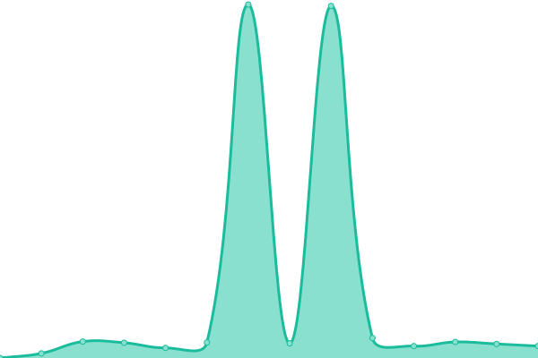
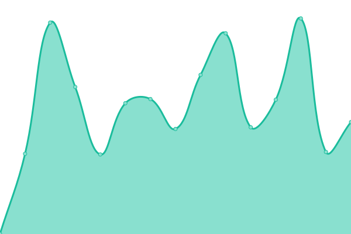

# [📈 Live Status](https://amixaam.github.io/amixaam-upptime): <!--live status--> **🟩 All systems operational**

This repository contains the open-source uptime monitor and status page for [Roberts Briņķis](https://amixam.id.lv), powered by [Upptime](https://github.com/upptime/upptime).

With [Upptime](https://upptime.js.org), you can get your own unlimited and free uptime monitor and status page, powered entirely by a GitHub repository. We use [Issues](https://github.com/amixaam/amixaam-upptime/issues) as incident reports, [Actions](https://github.com/amixaam/amixaam-upptime/actions) as uptime monitors, and [Pages](https://amixaam.github.io/amixaam-upptime) for the status page.

<!--start: status pages-->
<!-- This summary is generated by Upptime (https://github.com/upptime/upptime) -->
<!-- Do not edit this manually, your changes will be overwritten -->
<!-- prettier-ignore -->
| URL | Status | History | Response Time | Uptime |
| --- | ------ | ------- | ------------- | ------ |
|  [Portfolio](https://amixam.net) | 🟩 Up | [portfolio.yml](https://github.com/amixaam/amixaam-upptime/commits/HEAD/history/portfolio.yml) | 

 819ms
     
 | 

<a href="https://amixaam.github.io/amixaam-upptime/history/portfolio">100.00%</a>
    

|  [Photo-gallery](https://photos.amixam.net) | 🟩 Up | [photo-gallery.yml](https://github.com/amixaam/amixaam-upptime/commits/HEAD/history/photo-gallery.yml) | 

 790ms
     
 | 

<a href="https://amixaam.github.io/amixaam-upptime/history/photo-gallery">100.00%</a>
    

|  [Seafile](https://seafile.amixam.net) | 🟩 Up | [seafile.yml](https://github.com/amixaam/amixaam-upptime/commits/HEAD/history/seafile.yml) | 

 1081ms
     
 | 

<a href="https://amixaam.github.io/amixaam-upptime/history/seafile">99.85%</a>
    

|  [Skrazzo](https://skrazzo.xyz/stundas) | 🟩 Up | [skrazzo.yml](https://github.com/amixaam/amixaam-upptime/commits/HEAD/history/skrazzo.yml) | 

 1373ms
     
 | 

<a href="https://amixaam.github.io/amixaam-upptime/history/skrazzo">100.00%</a>
    

|  [Silver](https://vinetaerentraute.id.lv) | 🟩 Up | [silver.yml](https://github.com/amixaam/amixaam-upptime/commits/HEAD/history/silver.yml) | 

 1958ms
     
 | 

<a href="https://amixaam.github.io/amixaam-upptime/history/silver">55.38%</a>
    

<!--end: status pages-->

[**Visit our status website →**](https://amixaam.github.io/amixaam-upptime)

## 📄 License

- Powered by: [Upptime](https://github.com/upptime/upptime)
- Code: [MIT](./LICENSE) © [Anand Chowdhary](https://anandchowdhary.com), supported by [Pabio](https://pabio.com)
- Data in the `./history` directory: [Open Database License](https://opendatacommons.org/licenses/odbl/1-0/)
